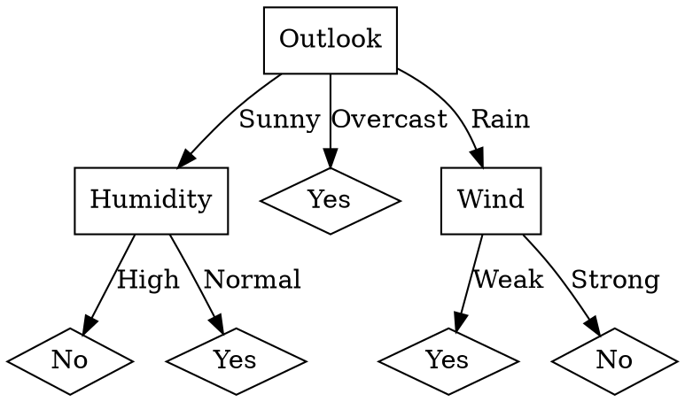

DecisionTreeBuilder
===================

Simple implementation of [ID3][id3] algorithm for discrete data. It
takes text file with decisions and produces output for
[Graphviz'][graphviz] dot tool for graph drawing.

## Usage
With given `play-ball.txt`

```
Day Outlook Temperature Humidity Wind Decision
D1 Sunny Hot High Weak No
D2 Sunny Hot High Strong No
D3 Overcast Hot High Weak Yes
D4 Rain Mild High Weak Yes
D5 Rain Cool Normal Weak Yes
D6 Rain Cool Normal Strong No
D7 Overcast Cool Normal Strong Yes
D8 Sunny Mild High Weak No
D9 Sunny Cool Normal Weak Yes
D10 Rain Mild Normal Weak Yes
D11 Sunny Mild Normal Strong Yes
D12 Overcast Mild High Strong Yes
D13 Overcast Hot Normal Weak Yes
D14 Rain Mild High Strong No
```

the output of running

```bash
$ DecisionTreeBuilder.exe play-ball.txt
```

would be `graph.dot` file



then we could run `dot` on `graph.dot`

```bash
$ dot -Tpng graph.dot -o graph.png
```

to produce graph image


[id3]: http://en.wikipedia.org/wiki/ID3_algorithm
[graphviz]: http://www.graphviz.org/
